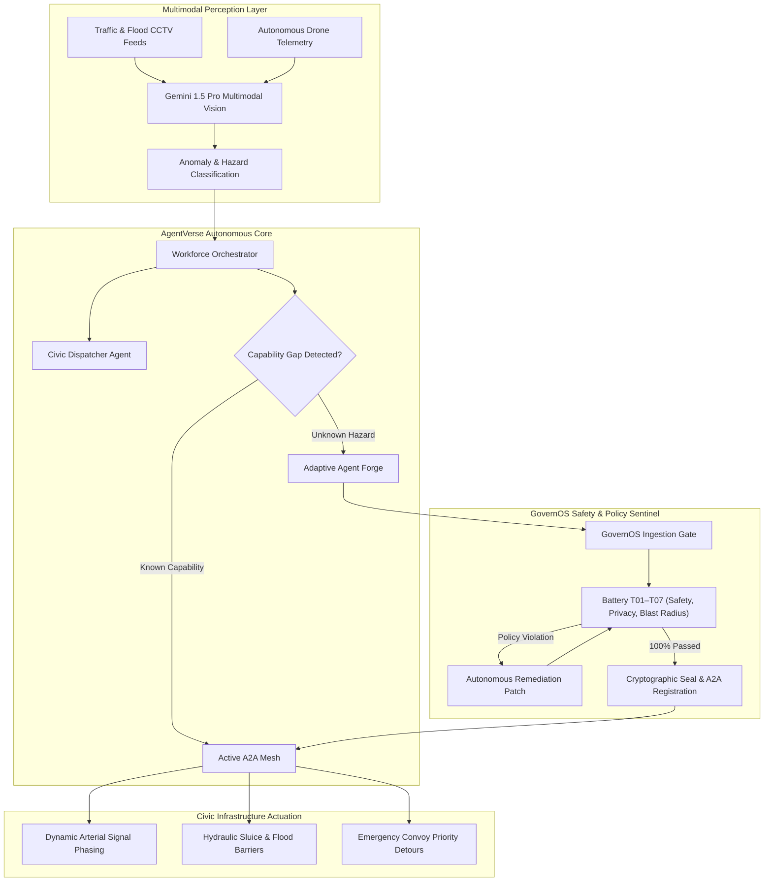

# CIVIS System Architecture

CIVIS is an Autonomous Multi-Agent Municipal Crisis Orchestration System designed to coordinate real-time disaster response across fragmented city authorities.



---

## 1. Architectural Layers

### 1.1 Multimodal Perception
- **Sensor Feeds:** Integrates with CCTV optical streams, FLIR thermal imaging, and hydrological depth sensors.
- **Perception Agents:** Analyzes inundation cresting rates and roadway blockage severity with continuous confidence scoring.

### 1.2 Orchestrator & A2A Mesh
- **A2A Protocol V2.4:** Structured agent-to-agent communication over mutual-TLS with strict schema validation.
- **Dynamic Task Decomposition:** Breaks complex civic emergencies into sub-tasks dispatched to specialized agents.

### 1.3 GovernOS Safety Kernel
- **Kernel-Level Authority Enforcement:** Every tool execution and telemetry access is intercepted and gated against municipal policy containers.
- **Protocol Zero:** Hard refusal on unauthorized access to citizen PII, resident location history, or critical grid shutdown without human cryptographic sign-off.
- **Immutable Provenance:** SHA-256 event chaining ensures complete transparency for all automated civic actions.

---

## 2. Directory Structure

```
CIVIS/
├── apps/
│   ├── api/             # FastAPI backend, agent runtimes, and Pytest test suites
│   │   ├── agents/      # Autonomous agent implementations
│   │   ├── core/        # Settings, database, and event bus
│   │   ├── engines/     # Evaluation, repair, and adaptation engines
│   │   ├── models/      # SQLAlchemy ORM schemas
│   │   ├── routers/     # REST endpoints
│   │   └── tests/       # 11 domain-driven automated test suites (41 tests)
│   └── web/             # Next.js 14 command dashboard
│       ├── src/app/     # App router pages and global styling
│       ├── src/components/ # Tactical map, command center, workforce mesh
│       └── src/lib/     # Client state store and SITREP report generators
├── docs/                # Architecture and governance specifications
├── evidence/            # Test verification reports and compliance proofs
└── scripts/             # Verification and local development utilities
```
